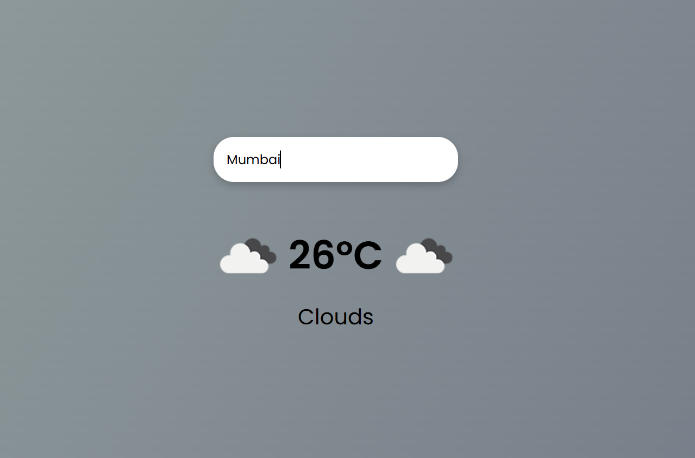
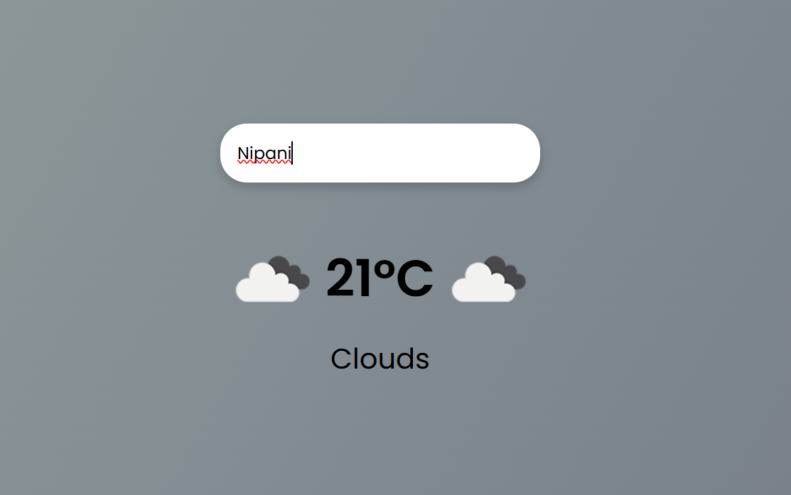

# Weather-App_Html_Css_Javascript
"Weather App using OpenWeatherMap API – A responsive web application created with HTML, CSS, and JavaScript that displays real-time weather conditions, temperature in Celsius, and weather icons. Includes error handling and clean UI design."
# 🌤 Weather App

A simple, responsive **Weather App** built using **HTML**, **CSS**, and **JavaScript**, powered by the [OpenWeatherMap API](https://openweathermap.org/api). This app allows users to search any city and view real-time weather conditions with temperature and icons in a clean and modern UI.

---

## 🔗 Live Demo
[👉 View the App](https://github.com/Akshatakhavare/Weather-App_Html_Css_Javascript/edit/main/README.md)  

---

## 📸 Screenshot

---

## 🚀 Features
- ✅ Real-time weather data
- ✅ Search weather by city name
- ✅ Displays temperature in Celsius (°C)
- ✅ Weather icons & condition text
- ✅ Error handling for invalid cities
- ✅ Loading state while fetching data
- ✅ Responsive & clean UI design

---

## 🛠 Technologies Used
- **HTML5**
- **CSS3**
- **JavaScript (ES6)**
- **OpenWeatherMap API**

---

